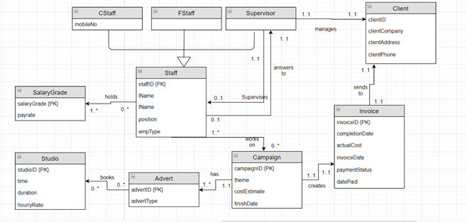
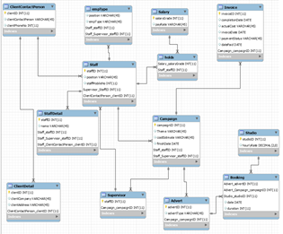

# ISYS224 Database Systems
*Completed for ISYS224 Database Systems at Macquarie University 2019*  
***By Quan Dang***

## **Problem Domain**
This question deals with a system used by an advertising agency called Shine to manage
clients’ advertising campaigns. Shine has a number of full-time staff members (such as
directors, administrative personnel, accountants, account managers, technical personnel)
and also a number of casual staff members (such as actors, models, graphic designers) who
can offer specialized skills for each advertising campaign for its clients. Casual staff
members do not have a permanent office in the agency and are contacted on their mobile
phone. Shine has a hierarchical management structure where each staff member (except
for the managing director) reports to a single supervisor within the company. 
Shine deals with other companies as its clients. A record is kept of each client company, and
each client company has one main contact person with Shine. Similarly, Shine nominates a
full-time member of its staff – a director, or an account manager to be the contact for each
client. Casual staff members are not eligible to be contact persons. 
Shine runs advertising campaigns for its clients, and a record is kept of every campaign.
Each campaign is based on a unique theme. One full-time member of Shine’s staff, again
either a director or an account manager, manages each campaign. Shine staff may work on
zero, or one or more campaigns at a time. For each campaign they work on, they are
answerable to the manager of that campaign, who may or may not be their own supervisor. 
When a campaign starts, an estimate of the cost and finish date needs to be set and agreed
upon. Each campaign includes one or more adverts. Adverts can be one of several types:
websites, newspapers, magazines, TV, etc. Shine currently operates five studios and each
advert may require a few bookings of studios for a number of hours on specific times and
dates. Shine charges an hourly rate for studio bookings. The actual cost of a campaign is
calculated from a range of information such as: cost of staff time, cost of studio time, cost
of consumables etc.  
The system also holds a number of fixed salary grades and annual and hourly pay rates of
each grade, so that the cost of staff time on a campaign can be calculated from the
timesheets that they fill out. Shine pays annual salaries to full-time staff but it charges
hourly pay rates to its clients. Casual staff members are also graded and they are paid based
on an hourly pay rate charged directly to the clients. Please note that (both full-time and
casual) staff members can have different salary grades during the campaign period (for
instance, when a staff member is given a pay rise right in the middle of a campaign).  
When the campaign is completed, an actual completion date and the actual cost are
recorded and a single invoice for the whole campaign is sent to the client. The issue date
and payment status of the invoice are also recorded. When the client pays, the date paid is
recorded.  
 

## **Task Specifications**
### Conceptual Model
Construct a conceptual data model in the form of an enhanced ER (EER) model for the
above problem domain  
***Answer***  
  
The EER model constructed in PowerDesigner   

### Inserting data into tables
Create and run the DML scripts to insert records into each of your tables.  

***Answer:***  

**ClientContact Person**
|clientID|clientContactPerson|ClientPhoneNo|
|---|---|---|
|01|Robert Menzes|1234567890|
|02|Albert Nobles|1123581321|
|03|Albert Einstein|114159265|
|04|Leonhard Euler|1271828182|
|05|George Washington|1987654321|

   

**ClientDetail**
|clientID|clientCompany|clientaddress|ClientContactPerson_clientID|
|---|---|---|---|
|01|Zeus|52 Olympus Way, Greece|01|
|02|Amatersu|42 Shinto Street, Tokyo|02|
|03|Hestia|46 Hearth Avenue, Greece|03|
|04|Anubis|1 Feather Lane, Egypt|04|
|05|Joseph|4 Judea Drive, Rome|05|

   

**Supervisor**
|staffID|Campaign_campaignID|
|---|---|
|04|01|
|04|05|
|05|02|
|05|04|
|05|03|

   

**Staff**
|staffID|position|staffMobileNo|Supervisor_StaffID|ClientContactPerson_clientID|
|---|---|---|---|---|
|1|Technical Personnel|1111111111|04|01|
|2|Actor|1111111112|04|02|
|3|Graphic Designer|1111111113|05|03|
|4|Director|1111111114|4|04|
|5|Account Manager|1111111115|5|05|

   

**Advert**
|AdvertID|AdvertType|CampaignID|
|--- |--- |--- |
|01|Websites|02|
|02|Newspaper|03|
|03|Magazine|01|
|02|Newspaper|04|
|03|Magazine|05|

   

**Campaign** 

|CampaignID|Theme|costEstimate|finishDate|Staff_staffID|Staff_Supervisor_staffID|
|--- |--- |--- |--- |--- |--- |
|01|Halloween|01|2019--10-12|01|04|
|02|New year|02|2019-12-11|03|05|
|03|Valentine|01|2019-01-21|01|05|
|01|Halloween|01|2019-10-12|02|04|
|04|Easter|01|2019-03-14|03|05|
|05|Christmas|03|2019-12-01|02|04|

   

**Studio**
|studioID|hourlyRate|
|---|---|
|1|1|
|2|1|
|3|1|
|4|1|
|5|1|

   

**Invoice**
|invoiceID|completionDate|actualCost|invoiceDate|paymentStatus|datePaid|Campaign_campaignID|
|---|---|---|---|---|---|---|
|01|2019-10-09|3|2019-10-10|Paid|2019-10-11|01|
|02|2019-12-12|2|2019-12-13|Paid|2019-12-20|02|
|03|2019-01-15|3|2019-01-17|Paid|2019-01-24|03|
|04|2019-03-16|1|2019-03-18|Paid|2019-03-19|04|
|05|2019-12-03|3|2019-12-04|Paid|2019-12-08|05|

   

**Salary**
|salaryGrade|payRate|
|---|---|
|01|1|
|02|2|
|03|3|
|04|4|
|05|5|

   

**holds**
|Salary_salaryGrade|Staff_staffID|
|---|---|
|01|02|
|01|03|
|02|01|
|03|04|
|03|05|

   

**Bookings**
|Advert_advertID|Advert_Campaign_campaignID|Studio_studioID|date|duration|
|---|---|---|--|---|
|01|02|01|2019-11-10|5|
|02|03|02|2019-01-12|3|
|03|01|03|2019-09-18|4|
|02|03|04|2018-12-02|2|
|02|03|05|2018-12-20|1|

   

**empType**
|position|empType|Staff_staffID|Staff_Supervisor_staffID|
|---|---|---|---|
|Technical Personnel|Full-time|01|04|
|Actor|Casual|02|04|
|Graphic Designer|Casual|03|05|
|Direct|Full-time|04|04|
|Account Manager|Full-time|05|05|

   

**StaffDetail**
|staffID|staffName|Staff_staffID|Staff_Supervisor_staffID|Staff_ClientContactPerson_clientID|
|---|---|---|---|---|
|1|Bob|1|04|01|
|2|Jess|2|04|02|
|3|Tom|3|05|03|
|4|Eve|4|04|04|
|5|Josh|5|05|05|

   

### Queries
* List the titles and themes of the Campaigns’ whose actual costs are below the average
estimated cost of all the campaigns.  
**Result:**

|campaignID|Theme|actualCost|AvgCostEstimate|
|---|---|---|---|

* List the campaign titles and the number of their advertisements whose completion
dates were earlier than their target dates.  
**Result:**
 
|campaignID|NoOfAds|completionDate|finishDate|
|---|---|---|---|
|01|02|2019-10-09|2019-10-12|
|03|01|2019-01-15|2019-01-21|

* List all the names of full-time staff members whose supervisor(s) were not the managers of the campaigns they worked on.  
**Result:**

|staffName|empType|staffID|campaign manager|Manager|Staff-staffID|
|---|---|---|---|---|---|
|Bob|Full-time|01|05|04|01|

* For campaigns with more than two staff members working on them, list the campaign
title and the number of staff members who had salary grade greater than 2. 
**Result:**

|campaignID|count(campaignID)|Salary_salaryGrade|
|---|---|---|

* List all the full-time staff members who do not manage any campaigns. 
**Result:**

|staffID|empType|position|SupervisorID|
|---|---|---|---|
|01|Full-time|Technical Personnel|04|
